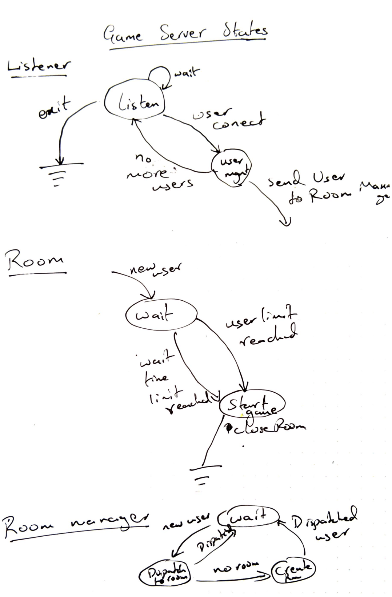
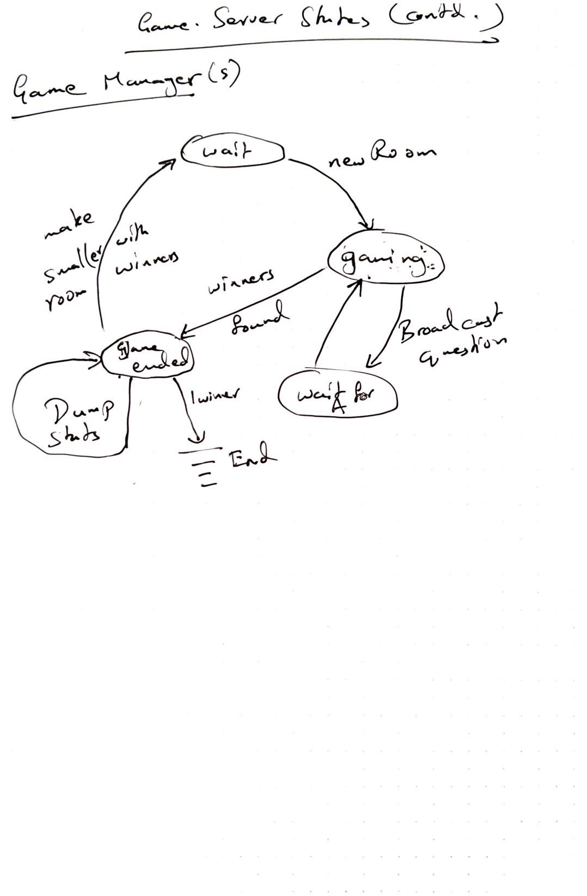

# trivia-game
---
Simple implementation of a game similar to HQ trivia game. The game is similar
in rules to the once popular [HQ Trivia game](https://en.wikipedia.org/wiki/HQ_(game))

## Requirements along with game rules
---
The following points capture requirements both in terms of game mechanics as
well as relevant game rules.

- The server starts up and waits for users to join.
- When users join, server will start a game under 2 conditions
  1. Room has enough users
  2. Users have waited a max time limit
- During game,
  1. Users have 10 seconds to answer
  2. Correct answers are tallied
  3. Top K users go the next round
  4. Remaining users are waved goodbye
  5. After a fixed set of rounds, the user(s) with the most correct answers win
- Multiple games can be in progress
- Users can join at any time

## Preliminary design
---
The following diagrams capture the ideas for a preliminary design.

