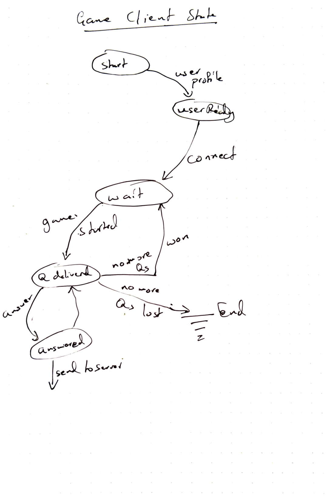

# Design documentation for the Trivia Game

The trivia game is designed simply as set of game clients connecting to a
game server listening on a known port. The communication is simply a set of
TCP messages passed between Client and server.

## Design 
---
The following diagrams capture the event state transition of the game system.
The system is designed to be a series of asynchronous non-blocking waits leaping
from state to state. All of the message processing is in short bursts, and
should not require multiple threads.

