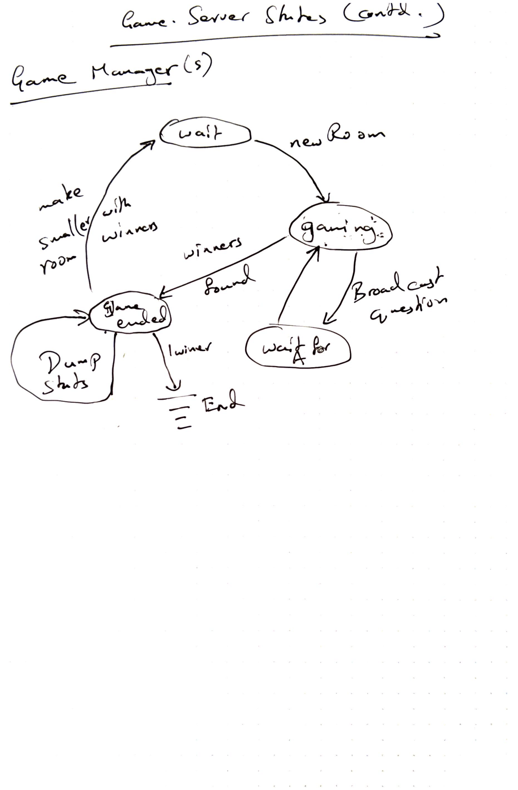

# Design documentation for the Trivia Game

The trivia game is designed simply as set of game clients connecting to a
game server listening on a known port. The communication is simply a set of
TCP messages passed between Client and server.

## Preliminary design
---
The following diagrams capture the ideas for a preliminary design.

